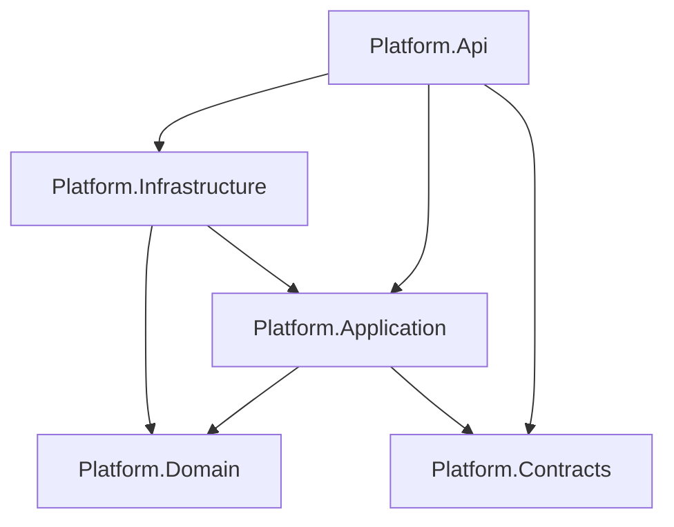
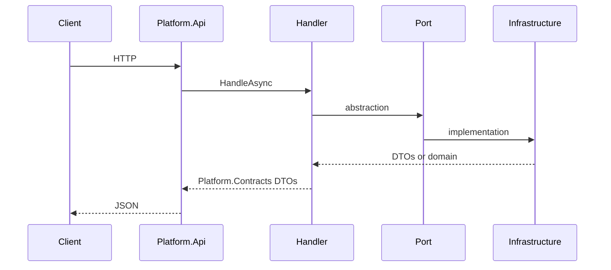

# Architecture

## High-level

The service is a **modular monolith** with **Clean Architecture–style** layers: business rules and use cases in **Application**, **Domain** for entities, **Infrastructure** for external systems, **Api** for HTTP, **Contracts** for **wire** DTOs.

**MediatR is not used** — use cases are **concrete** handler classes [registered in DI](backend-standards.md#project-decisions) and injected into **minimal API** route delegates.

## Dependency direction

Application **must not** reference Infrastructure or `Microsoft.EntityFrameworkCore`. Api references Application and Infrastructure to register services and map routes; Application defines **ports** that Infrastructure implements.

## Request path (v1)

- **Read paths:** For simple list/detail queries, Infrastructure may project to **Contract DTOs in EF** ([backend-standards.md](backend-standards.md)). For richer logic, the handler maps.
- **Unlock:** The Application handler returns an **outcome**; the Api issues the **session cookie** (see [auth-and-security.md](auth-and-security.md)).

## Project layout (feature-based)

- **Api:** [Features/](../src/Platform.Api/Features) — `*V1Routes` per area; [V1ApiRegistration.cs](../src/Platform.Api/Features/V1ApiRegistration.cs) composes `/api/v1`. Admin: [AdminAccessRoutes.cs](../src/Platform.Api/Features/Access/AdminAccessRoutes.cs).
- **Application:** [Features/…/use-case/](../src/Platform.Application/Features) — `*Query`, `*QueryHandler`, `*Command`, `*CommandHandler`, `*Validator`. **Abstractions:** [Abstractions/](../src/Platform.Application/Abstractions).
- **Infrastructure:** [Features/](../src/Platform.Infrastructure/Features) mirrors capabilities; [Persistence/](../src/Platform.Infrastructure/Persistence) has `PlatformDbContext`; [Temporal/](../src/Platform.Infrastructure/Temporal) implements [IWorkflowStarter](../src/Platform.Application/Abstractions/Workflows/IWorkflowStarter.cs).

## Related

- [backend-standards.md](backend-standards.md)
- [application-layer-guide.md](application-layer-guide.md)
- [infrastructure-guide.md](infrastructure-guide.md)
