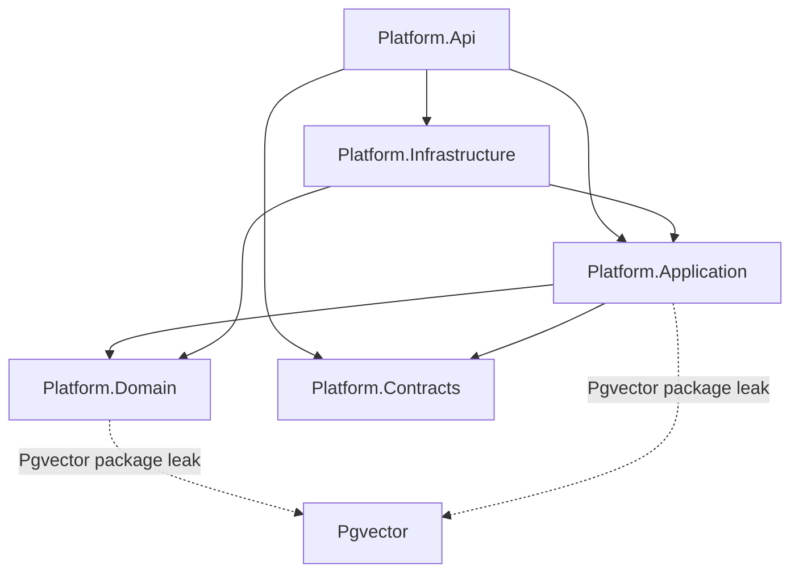

# Architecture and standards audit

**Date:** 2026-05-15  
**Scope:** `backend-platform/src` (Api, Application, Domain, Contracts, Infrastructure) and tests  
**Normative references:** [architecture.md](../architecture.md), [backend-standards.md](../backend-standards.md), [naming-conventions.md](../naming-conventions.md), layer guides under `docs/`

This report lists **gaps and risks** only. No code was changed as part of this audit.

---

## Executive summary

**Project references and core dependency flow are correct:** Application does not reference Infrastructure or EF; Domain has no upward references; Infrastructure references Application + Domain only; Api composes Application + Infrastructure + Contracts as documented.

The main issues are **layer leaks** (persistence libraries and types in Domain/Application, Api reaching into Infrastructure persistence and Domain exceptions), **operational defaults** that conflict with documented production guidance, **duplicated cross-cutting concerns** (status formatting, exception mapping), and **testing/validation gaps** on newer features (News feed/embed path). Several items are **documented intentional debt** (legacy memory insights, workflow status mapper duplication) but still belong on a fix list.

---

## What already aligns

| Area | Status |
| --- | --- |
| **No MediatR** | No mediator usage in source |
| **Handler registration** | All 56 `*Handler` types under Application are registered in `DependencyInjection.cs` or `MemoryApplicationServiceCollectionExtensions.cs` |
| **DI order in host** | `AddPlatformApplication()` before `AddPlatformInfrastructure()` in [Program.cs](../../src/Platform.Api/Program.cs) |
| **Ports in Application** | Abstractions live under `Platform.Application/Abstractions`; implementations in Infrastructure |
| **No EF in Application/Domain** | No `Microsoft.EntityFrameworkCore` usings in those projects |
| **Feature layout** | Api / Application / Infrastructure / Domain use parallel `Features/` folders |
| **v1 route composition** | Product routes registered via [V1ApiRegistration.cs](../../src/Platform.Api/Features/V1ApiRegistration.cs) |
| **Internal worker auth** | `/api/internal/v1/*` gated by [InternalWorkerAuthenticationMiddleware.cs](../../src/Platform.Api/Middleware/InternalWorkerAuthenticationMiddleware.cs) |
| **Unlock / cookie model** | Session issuance stays in Api; [UnlockSessionCommandHandler](../../src/Platform.Application/Features/Access/UnlockSession/UnlockSessionCommandHandler.cs) returns outcome |
| **Workflow status strings (today)** | [WorkflowRunStatusFormatter](../../src/Platform.Application/Features/WorkflowRuns/Shared/WorkflowRunStatusFormatter.cs) and [WorkflowRunStatusMapper](../../src/Platform.Infrastructure/Features/WorkflowRuns/WorkflowRunStatusMapper.cs) currently produce the same mapping |

---

## 1. Dependency direction and layering

### 1.1 Api references Infrastructure persistence directly (High)

**Standard:** Api should depend on Application (handlers/ports) and register Infrastructure via DI; Application must not see `DbContext` ([backend-standards.md](../backend-standards.md)).

**Finding:**

- [Program.cs](../../src/Platform.Api/Program.cs) imports `Platform.Infrastructure.Persistence` and uses `PlatformDbContext` for:
  - **Migrations on every startup** (`MigrateAsync` in a scope)
  - **`GET /ready`** health check (`CanConnectAsync`)

**Why it matters:** The HTTP host is coupled to EF and a concrete DbContext instead of a port (e.g. `IDatabaseHealthCheck`). It also makes Api responsible for schema migration orchestration, which [backend-standards.md](../backend-standards.md) says should be a **deploy pipeline / job in production**, not implicit per-instance startup.

**Suggested direction:** Introduce a small Application abstraction for readiness; run migrations from a dedicated host/CLI/job in production; keep dev startup migration only behind environment checks if desired.

---

### 1.2 Api references Domain types (Medium)

**Standard:** [architecture.md](../architecture.md) diagram shows Api → Application + Contracts + Infrastructure, not Api → Domain.

**Finding:**

- [Program.cs](../../src/Platform.Api/Program.cs): `using Platform.Domain.Features.Memory` for `MemoryConflictException` in global exception handler.
- [InternalMemoryV1Routes.cs](../../src/Platform.Api/Features/Memory/Internal/InternalMemoryV1Routes.cs): catches `MemoryConflictException` in the route delegate.

**Why it matters:** HTTP layer is bound to domain exception types. Adding or renaming domain exceptions forces Api changes; the documented pattern is Application **outcomes** and Api maps those to status codes (similar to `UnlockSessionOutcome`).

**Suggested direction:** Map conflicts in Application handlers to a result type or application-level exception that Api translates once (or only in middleware), without `using Platform.Domain` in route files.

---

### 1.3 `Pgvector` package in Domain and Application (Medium)

**Standard:** Domain should be persistence-agnostic POCOs/enums ([domain-layer-guide.md](../domain-layer-guide.md)). Application must not reference EF; persistence adapters belong in Infrastructure.

**Finding:**

| Project | Usage |
| --- | --- |
| [Platform.Domain.csproj](../../src/Platform.Domain/Platform.Domain.csproj) | Package reference `Pgvector` |
| [Platform.Application.csproj](../../src/Platform.Application/Platform.Application.csproj) | Package reference `Pgvector` |
| Domain entities | `NewsItemEmbedding`, `NewsUserProfile`, `MemoryEmbedding` expose `Pgvector.Vector` |
| Application handlers | [EmbedNewsItemCommandHandler](../../src/Platform.Application/Features/News/Embed/EmbedNewsItemCommandHandler.cs), [SeedNewsProfileCommandHandler](../../src/Platform.Application/Features/News/Profile/SeedNewsProfileCommandHandler.cs) construct `new Vector(...)` on domain entities |

**Why it matters:** The vector store’s CLR type is fixed in inner layers. Swapping embedding storage or testing Application without `Pgvector` becomes harder. This is a **dependency direction leak** (infrastructure concern embedded in Domain/Application).

**Suggested direction:** Use `float[]` or a domain value type in Domain/Application; map to `Pgvector.Vector` only in Infrastructure repositories/EF configuration.

---

### 1.4 Infrastructure uses Application feature internals (Low)

**Finding:** [EfMemoryContextProvider](../../src/Platform.Infrastructure/Features/Memory/Context/EfMemoryContextProvider.cs) and [EfSemanticMemoryReadRepository](../../src/Platform.Infrastructure/Features/Memory/Semantic/EfSemanticMemoryReadRepository.cs) call `MemoryContextV1Scoring` in `Platform.Application.Features.Memory.Context`.

**Assessment:** Project reference direction is valid (Inf → App). This is acceptable in a modular monolith but couples Infrastructure to **feature implementation** rather than a narrow port or shared kernel. Prefer moving scoring helpers to `Application` shared module namespace documented as “used by Inf projections” or behind an interface if the logic grows.

---

### 1.5 Infrastructure does not reference Contracts directly (Informational)

**Finding:** [Platform.Infrastructure.csproj](../../src/Platform.Infrastructure/Platform.Infrastructure.csproj) has no `ProjectReference` to Contracts; Infrastructure still uses `Platform.Contracts` types via transitive reference from Application.

**Assessment:** Allowed by current standards (Infrastructure **may** project to contract DTOs). Optional hardening: add an explicit Contracts reference for clarity, or stop projecting DTOs in Inf for complex features and map in Application only.

---

## 2. Backend standards compliance

### 2.1 Migrations on API startup in all environments (High — operations)

**Standard:** Dev/test startup migration OK; **production** should use pipeline/job ([backend-standards.md](../backend-standards.md)).

**Finding:** [Program.cs](../../src/Platform.Api/Program.cs) always runs `db.Database.MigrateAsync()` before the app serves traffic (no `IsDevelopment()` guard).

**Suggested direction:** Gate on environment or configuration flag; document runbook for production migration job.

---

### 2.2 Hardcoded database connection fallback (Medium — security/ops)

**Finding:** [DependencyInjection.cs](../../src/Platform.Infrastructure/DependencyInjection.cs) falls back to  
`Host=localhost;Port=5432;Database=platform;Username=platform;Password=platform` when `ConnectionStrings:Default` is missing.

**Why it matters:** [persistence-guide.md](../persistence-guide.md) notes this as dev convenience; in misconfigured production it could silently point at a default database.

**Suggested direction:** Fail fast outside Development/Testing when connection string is absent.

---

### 2.3 FluentValidation → 400 ProblemDetails not implemented (Medium)

**Standard:** Validation failures should return **400** with structured ProblemDetails ([backend-standards.md](../backend-standards.md), [error-handling-and-validation.md](../error-handling-and-validation.md)).

**Finding:** [Program.cs](../../src/Platform.Api/Program.cs) exception handler does not special-case `ValidationException`. Unhandled validation may become generic 500 responses.

**Suggested direction:** Add exception handler branch (or endpoint filter) mapping FluentValidation to RFC 7807 field errors.

---

### 2.4 Validation in Api route instead of Application (Medium)

**Finding:** [InternalNewsV1Routes.cs](../../src/Platform.Api/Features/News/Internal/InternalNewsV1Routes.cs) parses `PublishedAt` with `DateTimeOffset.TryParse` and returns 400 from the route. Ingest has [IngestNewsItemCommandValidator](../../src/Platform.Application/Features/News/Ingest/IngestNewsItemCommandValidator.cs) but the route builds the command **before** handler/validator sees invalid dates if the request shape differs.

**Suggested direction:** Accept string in command, validate in FluentValidation, let handler assume invariant; route stays thin per [feature-development-guide.md](../feature-development-guide.md).

---

### 2.5 Contract records with optional parameters + EF expression trees (Medium — footgun)

**Standard:** Infrastructure may project to contract DTOs in EF for simple reads.

**Finding:** [NewsItemSummaryDto](../../src/Platform.Contracts/V1/NewsItemSummaryDto.cs) has optional parameters (`Url`, `Body`, `RelevanceScore`). Omitting the last argument in an EF `Select` causes compiler error: *"An expression tree may not contain a call or invocation that uses optional arguments."*

**Current state:** [NewsReadRepository](../../src/Platform.Infrastructure/Features/News/NewsReadRepository.cs) passes explicit `null` for `RelevanceScore` in EF projections (fixed pattern). [SemanticMemorySummaryV1Dto](../../src/Platform.Contracts/V1/Memory/SemanticMemorySummaryV1Dto.cs) also has optional `Status`; [EfSemanticMemoryReadRepository](../../src/Platform.Infrastructure/Features/Memory/Semantic/EfSemanticMemoryReadRepository.cs) avoids the issue by materializing entities then mapping in memory.

**Suggested direction:** Remove default parameters from wire DTOs used in EF projections, or always pass all constructor arguments in LINQ. Document in [infrastructure-guide.md](../infrastructure-guide.md).

---

### 2.6 Duplicate workflow run status formatting (Low — documented debt)

**Standard:** [infrastructure-guide.md](../infrastructure-guide.md) — converge on one approach over time.

**Finding:** Duplicate static classes:

- Application: `WorkflowRunStatusFormatter`
- Infrastructure: `WorkflowRunStatusMapper` (used inside EF `Select` in [WorkflowRunRepository](../../src/Platform.Infrastructure/Features/WorkflowRuns/WorkflowRunRepository.cs))

**Risk:** Future enum values or string changes can drift despite identical switch bodies today.

**Suggested direction:** Single shared helper in Application (Inf already references App) marked for use in EF projections, or map status in Application after load for list queries.

---

### 2.7 Port abstraction documents persistence (Low)

**Finding:** [IProceduralRuleService](../../src/Platform.Application/Abstractions/Memory/Procedural/IProceduralRuleService.cs) XML comment references **DbContext** and transactions.

**Why it matters:** Application ports should describe behavior, not EF. Misleading for clean architecture readers.

**Suggested direction:** Reword to “within the same unit of work” without naming DbContext.

---

### 2.8 `IMemoryEmbeddingGenerator` registration order and lifetime (Low)

**Finding:**

1. [MemoryInfrastructureServiceCollectionExtensions](../../src/Platform.Infrastructure/Features/Memory/DependencyInjection/MemoryInfrastructureServiceCollectionExtensions.cs) registers `IMemoryEmbeddingGenerator` as **Singleton** (deterministic or no-op).
2. [DependencyInjection.cs](../../src/Platform.Infrastructure/DependencyInjection.cs) registers `IMemoryEmbeddingGenerator` again as **Scoped** (`OpenAiEmbeddingGenerator`).

**Assessment:** Last registration wins for default resolution; news and memory share one generator interface. Worth documenting that OpenAI **replaces** the memory stub globally, and that mixed singleton/scoped registration is intentional or should be unified.

---

## 3. Api and routing conventions

### 3.1 Internal routes not registered via `V1ApiRegistration` (Low)

**Standard:** [feature-development-guide.md](../feature-development-guide.md) — register v1 routes in `V1ApiRegistration`; internal routes are a separate surface.

**Finding:** [Program.cs](../../src/Platform.Api/Program.cs) maps `InternalMemoryV1Routes`, `InternalNewsV1Routes`, `InternalSideLearningV1Routes` **after** `MapV1Endpoints()`, outside [V1ApiRegistration.cs](../../src/Platform.Api/Features/V1ApiRegistration.cs).

**Assessment:** Acceptable if intentional; inconsistent with “single registration file” mental model. Consider a dedicated `MapInternalEndpoints()` extension for discoverability.

---

### 3.2 Hardcoded `UserId: 1` on public news feed (Medium — product/tech debt)

**Finding:** [NewsV1Routes.cs](../../src/Platform.Api/Features/News/NewsV1Routes.cs) calls `new ListNewsFeedQuery(UserId: 1)` with comment “single-user system for now”. [ListNewsFeedQuery](../../src/Platform.Application/Features/News/ListFeed/ListNewsFeedQuery.cs) also defaults `UserId = 1`.

**Why it matters:** Personalized vector ranking uses `INewsVectorSearch` with that id; wrong id silently affects all clients.

**Suggested direction:** Derive user from future identity model or explicit query parameter with validation until real auth exists.

---

## 4. Domain and persistence

### 4.1 `IMemoryItemReadRepository` still stubbed (Medium — functional gap)

**Finding:** [MemoryInfrastructureServiceCollectionExtensions.cs](../../src/Platform.Infrastructure/Features/Memory/DependencyInjection/MemoryInfrastructureServiceCollectionExtensions.cs) registers `MemoryItemReadRepositoryStub` for `IMemoryItemReadRepository`.

**Why it matters:** Any handler depending on real memory item reads gets empty data unless another registration overrides it (none found).

**Suggested direction:** Implement EF repository or remove port until needed; document if deliberately deferred.

---

### 4.2 Legacy memory insights still wired (Low — planned removal)

**Finding:** [LEGACY_MEMORY_REMOVAL.md](../memory/LEGACY_MEMORY_REMOVAL.md) describes removal; code still registers:

- `ListMemoryInsightsQueryHandler`
- `ILegacyMemoryInsightsReadRepository` → `LegacyMemoryInsightsReadRepository`
- [MemoryInsightsV1Routes](../../src/Platform.Api/Features/Memory/Legacy/Insights/MemoryInsightsV1Routes.cs)

**Suggested direction:** Track removal per legacy doc when governed memory UI no longer needs the seed table.

---

## 5. Testing gaps (normative direction)

**Standard:** New commands and non-trivial handlers should have unit tests (mocked ports) and integration tests for critical HTTP flows ([backend-standards.md](../backend-standards.md), [testing-guide.md](../testing-guide.md)).

| Feature / path | Unit tests | Integration tests | Notes |
| --- | --- | --- | --- |
| Memory module | Many | Many under `Platform.IntegrationTests` | Strong coverage |
| Side learning | Partial (validators) | `SideLearningSessionsV1Tests` | — |
| News ingest/delete | — | `InternalNewsV1Tests`, `NewsV1DeleteTests` | — |
| **News feed (vector ranking)** | **None** | **None** | `ListNewsFeedQueryHandler` untested |
| **News embed / profile seed** | **None** | Partial via internal ingest tests only | No dedicated embed/seed contract tests |
| Dashboard / Stats / Profile / SavedItems / HumanInput | — | — | Read-heavy; lower risk but no HTTP regression tests |
| Workflow runs (start/list) | Validator only | — | No integration test for start/list |

---

## 6. Commands/handlers without FluentValidation

Not every handler needs a validator; the standard targets **non-trivial commands**. Gaps worth addressing:

| Handler | Note |
| --- | --- |
| [EmbedNewsItemCommandHandler](../../src/Platform.Application/Features/News/Embed/EmbedNewsItemCommandHandler.cs) | No validator for `NewsItemId` |
| [SeedNewsProfileCommandHandler](../../src/Platform.Application/Features/News/Profile/SeedNewsProfileCommandHandler.cs) | No validator for `UserId` |
| Several Memory **command** handlers (approve/reject/archive semantic, nightly consolidation, etc.) | Validators exist for create/patch flows but not all write paths |

---

## 7. Package / TFM consistency (Low)

**Finding:** [Platform.Application.csproj](../../src/Platform.Application/Platform.Application.csproj) references `Microsoft.Extensions.*` **9.0.0** while Api/Infrastructure use **10.0.0** on net10.0.

**Risk:** Subtle behavioral differences or binding redirects; prefer aligning extension package versions with the shared framework.

---

## 8. Positive dependency graph (reference)

**Csproj references observed:** match the intended graph except Api’s **transitive effective** use of Domain (via handler signatures/exceptions) and **direct** Persistence usage.

---

## Suggested prioritization (for when you implement)

1. **Production migrations** — stop unconditional `MigrateAsync` on Api startup; pipeline/job + runbook.  
2. **Api ↔ persistence boundary** — remove `PlatformDbContext` from Program routes; readiness port.  
3. **Api ↔ Domain exceptions** — conflict/outcome mapping in Application.  
4. **Pgvector layering** — `float[]` in Domain/Application, map in Infrastructure.  
5. **Validation pipeline** — FluentValidation → 400 ProblemDetails.  
6. **News tests** — feed ranking, embed, profile seed.  
7. **Consolidate workflow status strings** — single formatter.  
8. **Legacy memory removal** — per existing doc.  
9. **Contract optional parameters** — policy for EF-safe DTOs.

---

## Audit method

- Reviewed all seven `.csproj` project references and package references.  
- Grepped for MediatR, EF in Application/Domain, Infrastructure in Application, HttpContext in Application, Api→Domain usings.  
- Compared handler files to DI registrations (56 handlers, all registered).  
- Cross-checked docs: `architecture.md`, `backend-standards.md`, layer guides, `error-handling-and-validation.md`, `LEGACY_MEMORY_REMOVAL.md`.  
- Spot-checked News, Memory, WorkflowRuns, and host startup behavior.
